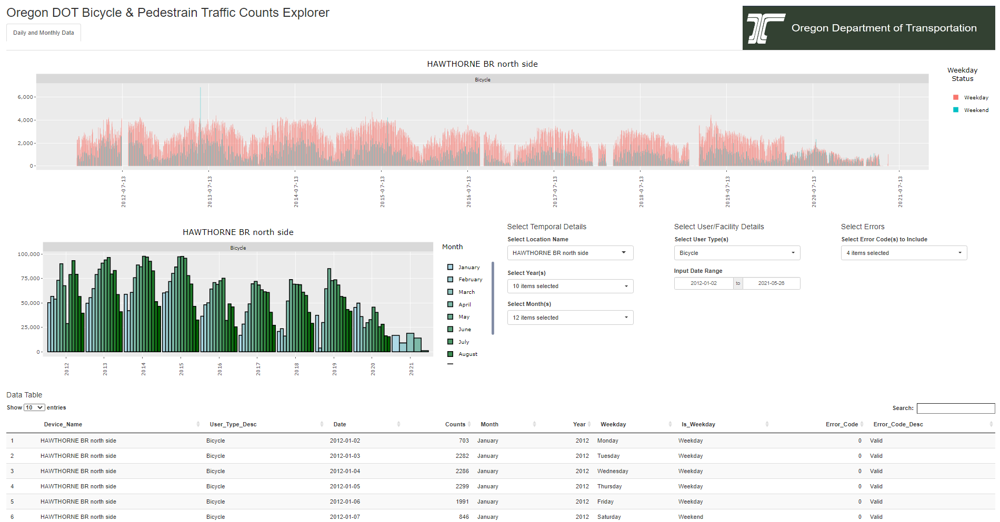

# Project Summary  
This repository contains scripts and inputs that allow for accessing bicycle and pedestrian traffic counts data from traffic count device manufacturer Eco COunters Application Programming Interface (API).

# Script Details  
The scripts in this repository allow users to employ the Eco Counter Application Programming Interface (API) and relevant credentials to download and prepare non-motorized traffic counts data.  The process involved includes 
three steps explained below.  The repo also includes a basic data viewer which utilizes R Shiny packages.  

## pull_data-via_api_step_1.r  
This script requires an API credential to properly utilize and depending on the domain details linked to the credentials will allow the user to access all the data included in that domain's database stored by Eco Couner.
## process_raw_counts_step_2.r  
This script processes the raw counts data downloaded in Step 1 formatting data elements like date and time and appending helpful temporal details like month and day of week.  
## apply_qaqc_step_3.r
This script applies Quality Assurance and Quality Control (QAQC) steps documented in [this report](https://www.oregon.gov/odot/Programs/ResearchDocuments/SPR_813Final-Nonmotorized.pdf) in Chapter 4.  Suspect daily data are flagged 
using four different flags including consecutive zeros, data outside expected bounds based on recent hsitory, excessively high values, and days of suspect data from a manually entered set of suspect data.  
## run_main.r  
This script is a main script used as a wrapper for the scripts 1 through 3 and also allows for running the basic data visualization script.  This data visualization is previewed in the screen shot below

### Data Visualization Preview

# Contact
Josh Roll  josh.f.roll@odot.state.or.us  

